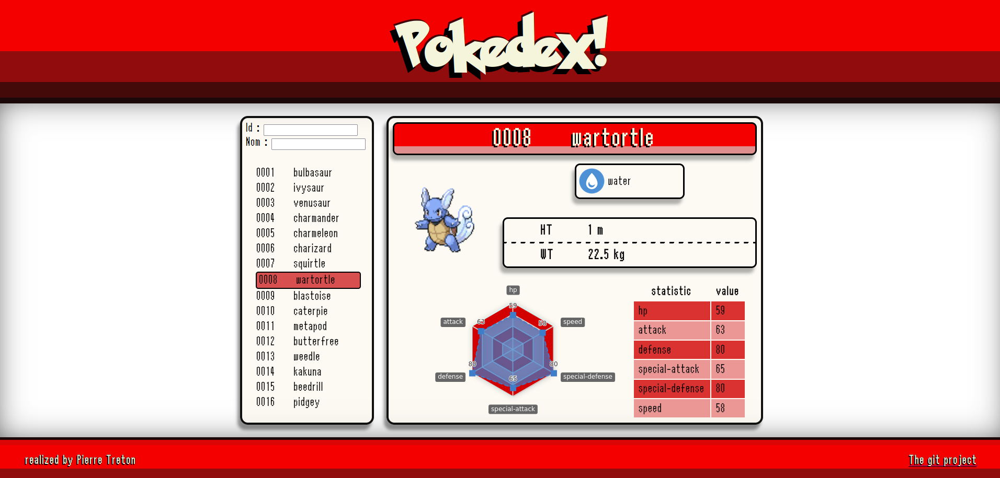

# Pokedex Angular

Project of pokedex to test the Angular Framework.
Author : Pierre Treton

// TODO

[EN]

## Functionalities

* Retrieve all pokemons as a list using API request (Q10-Q11-Q12)
* Display the complete pokemon list in the app (Q5-Q6)
* Filtering pokemon list on both id and name (Q7-Q8)
* (even though it's ugly) Using Material UI inputs for the filters inputs (Q9bis)
* Request detailled infos about the selected pokemon using a service that makes an API call, then updates pokemon informations on selection change (Q13)
* Display pokemon informations in a dedicated component that subscribe to the service to be receive newest pokemon details on selection updated (Q14-Q15-Q16)

## Taken liberties

In order to improve UI and UX, I chose to implements certain things a different way:

* There is no display of the id and name filters apart from the input's one id and name typed in filter inputs
* When app is loaded, the first pokemon in the list is selected, therefore displayed to avoid a blank screen or a message telling the user to select the pokemon  
* The select element was replaced by a list that fills the page's height with a scroll so ther is less clicks in the process
* The "Go" button was removes to allow pokemon infos display directly when an element is selected in the pokemon list. This, paired with the aformentioned list really enhance the user experience

[FR]

## Fonctionnalités

* Récupération de tous les pokémons via requête API (Q10-Q11-Q12)
* Affichage de la liste complète des pokémons (Q5-Q6)
* Recherche et filtrage des pokémons sur l'identifiant et le nom (Q7-Q8)
* (même si ce n'est pas beau) Intégration des inputs Material UI pour les filtres (Q9bis)
* Requête API des infos détaillées du Pokémon sélectionné via un service qui met à jour les informations lorsque la sélection change (Q13)
* Affichage des informations du pokémon dans un composant dédié; Ce composant s'abonne au service qui reçoit la mise à jour lors de la sélection (Q14-Q15-Q16)

## Liberté prises

Afin de rendre l'UI/UX plus agréable, j'ai fait le choix de modifier certains aspects de l'application:

* Il n'y a pas d'affichage de l'id saisi ni du nom saisi dans les filtres
* Quand l'application est chargée, le premier pokemon de la liste est sélectionné et ses informations sont affichés, afin d'éviter un affichage qui dit à l'utilisateur de faie son choix
* Le select a été remplacé par une liste qui fait la hauteur de la page afin de simplifier son utilisation
* Le bouton "Go" a été enlevé pour permettre l'affichage du pokémon sélectionné directement lorsqu'il est sélectionné dans la liste, ceci améliore grandement avec le précédent point l'expérience utilisateur

